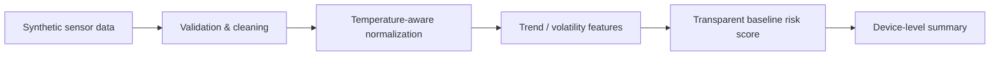

# SF₆ Leak Detection — Public Showcase

[](https://github.com/LiLinWilliam/sf6-leak-detection-showcase/actions/workflows/demo-check.yml)

A portfolio-oriented demonstration of industrial time-series monitoring for gas-insulated electrical equipment.

This repository is intentionally **independent from the private research implementation**. It uses synthetic data and a simplified, transparent baseline so that the workflow can be inspected and executed without exposing proprietary code, private datasets, site identifiers, or patent-related implementation details.

## What this demonstrates

- Industrial time-series preprocessing
- Sensor quality checks and robust outlier handling
- Temperature-aware pressure normalization
- Trend and anomaly feature engineering
- Risk scoring for potential gas leakage
- Reproducible analysis on synthetic data
- Clear separation between a public demo and protected/private R&D

## Problem

Gas pressure measurements in electrical equipment are affected by temperature, sensor noise, missing samples, short-term disturbances, and long-term degradation. A useful monitoring pipeline therefore needs to distinguish ordinary environmental variation from persistent abnormal behavior.

The public demo follows this high-level flow:



## Public demo vs. private implementation

| Public showcase | Kept private |
|---|---|
| Synthetic data generator | Real operational datasets |
| Generic preprocessing patterns | Site/device-specific preprocessing |
| Transparent baseline scoring | Proprietary model logic and tuned decision rules |
| High-level architecture | Patent-related implementation details |
| Reproducible example output | Private model artifacts and production configuration |

**No file in this repository is copied from the private evidence repository.**

## Quick start

```bash
python -m venv .venv

# Windows
.venv\Scripts\activate

# macOS / Linux
source .venv/bin/activate

pip install -r requirements.txt
python examples/synthetic_demo.py
```

The demo writes two files to `output/`:

- `synthetic_sensor_data.csv` — generated sample measurements
- `risk_summary.csv` — per-device monitoring summary

With the fixed demo seed, the example includes stable, noisy, mildly degrading, and clearly degrading synthetic traces. The intended qualitative result is:

| Synthetic device | Demo interpretation |
|---|---|
| `DEMO-STABLE` | low demo risk |
| `DEMO-NOISY` | low demo risk despite extra noise |
| `DEMO-WATCH` | review |
| `DEMO-DECLINE` | high demo risk |

## Repository structure

```text
.
├── README.md
├── LICENSE
├── NOTICE.md
├── requirements.txt
├── docs/
│   ├── ARCHITECTURE.md
│   └── METHODOLOGY.md
├── examples/
│   └── synthetic_demo.py
└── .github/
    └── workflows/
        └── demo-check.yml
```

## Engineering principles

1. **Explainable first** — the public baseline is intentionally simple enough to audit.
2. **Time-aware analysis** — trends and persistence matter more than isolated points.
3. **Physics-aware thinking** — environmental effects should be separated from degradation signals where possible.
4. **Reproducibility** — the demo uses deterministic random seeds and generated data.
5. **IP hygiene** — public examples demonstrate capability without leaking proprietary implementation details.

## Scope and limitations

This repository is a technical portfolio demonstration, **not** a certified protection, alarm, diagnostic, or maintenance system. Synthetic examples do not establish field performance, reliability, or safety compliance. The scoring constants in the public demo are illustrative and are not operational thresholds.

## License and IP boundary

The material published in this repository is licensed under **BSD-3-Clause-Clear**. This variant explicitly states that no express or implied patent license is granted.

The license covers only material actually published here. It does not license any separate private repository, patent, private dataset, model artifact, confidential implementation, or unpublished know-how. See [`NOTICE.md`](NOTICE.md) for the repository's public/private boundary.

## About the developer

I build practical ML/AI systems with an emphasis on data pipelines, anomaly detection, time-series modeling, model evaluation, and automation.

**Available for freelance and contract work** involving Python, ML/AI prototypes, data analysis, industrial time series, and automation.

If you are evaluating this repository for a project, feel free to open an issue describing the problem you are trying to solve.
