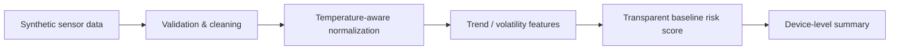

# SF₆ Leak Detection — Public Showcase

[](https://github.com/LiLinWilliam/sf6-leak-detection-showcase/actions/workflows/demo-check.yml)


A portfolio-oriented demonstration of industrial time-series monitoring for gas-insulated electrical equipment.

This repository is intentionally **independent from the private research implementation**. It uses synthetic data and a simplified, transparent baseline so that the workflow can be inspected and executed without exposing proprietary code, private datasets, site identifiers, or patent-related implementation details.

## 中文介绍

这是一个面向作品集与技术能力展示的 **SF₆ 气体绝缘电气设备时序监测项目**。公开仓库展示的是一套可以直接阅读和运行的独立 Demo，用于说明工业时序数据处理、异常检测、环境因素归一化、趋势分析与风险评分等工程能力。

本仓库与私有研究/专利证据仓库**相互独立**。这里使用的全部设备名称、时间序列和测量值均为合成数据；公开实现也是为展示目的重新编写的简化基线，不包含私有源代码、真实运行数据、现场或设备标识、私有模型权重、生产参数以及与专利相关的核心实现细节。

### 这个项目展示什么

- 工业时序数据清洗与预处理
- 传感器数据质量检查和稳健异常值处理
- 考虑温度影响的压力归一化
- 趋势、波动和异常特征工程
- 面向潜在泄漏风险的可解释评分
- 基于合成数据的可复现实验
- 公开 Demo 与私有研发/知识产权之间的清晰隔离

### 公开内容与私有实现的边界

| 公开 Showcase | 保持私有 |
|---|---|
| 合成数据生成器 | 真实运行数据 |
| 通用数据处理方法 | 面向具体现场/设备的数据处理逻辑 |
| 透明、简化的演示评分 | 私有模型逻辑与调优后的决策规则 |
| 高层架构和方法说明 | 专利相关核心实现细节 |
| 可复现的示例输出 | 私有模型权重和生产配置 |

**本公开仓库没有从私有证据仓库复制任何文件。**

这是一个技术作品展示，不是经过认证的保护、报警、诊断或检修系统。公开 Demo 中的评分常数仅用于让合成场景便于观察，不代表实际现场阈值或安全标准。

本仓库采用 **BSD-3-Clause-Clear** 许可证；该许可证明确不授予任何明示或默示的专利许可。许可证只适用于本仓库实际公开的材料，不覆盖任何独立的私有仓库、专利、数据集、模型、机密实现或未公开 know-how。

**可承接 Python、ML/AI 原型、数据分析、工业时序建模、异常检测和自动化相关的自由职业/合同项目。**

如果你正在评估合作，可以直接通过本仓库的 **Issues → New issue → Project inquiry / 项目咨询** 留下需求概述。

### 贡献者 / Contributors

- **LiLinWilliam** — 项目所有者、维护者、领域工作与公开 Showcase 方向。
- **ChatGPT (GPT-5.6 Sol, OpenAI)** — AI collaborator，参与公开 Showcase 的结构设计、文档、合成 Demo、仓库整理和表达优化。

对于 AI 实际参与的提交，本仓库使用 GitHub 原生 `Co-authored-by` 机制，并采用 OpenAI 官方 Codex 共同作者身份 `Codex <codex@openai.com>`，因此相关提交可以由 GitHub 原生识别共同作者。详细说明见 [`CONTRIBUTORS.md`](CONTRIBUTORS.md)。

---

## What this demonstrates

- Industrial time-series preprocessing
- Sensor quality checks and robust outlier handling
- Temperature-aware pressure normalization
- Trend and anomaly feature engineering
- Risk scoring for potential gas leakage
- Reproducible analysis on synthetic data
- Clear separation between a public demo and protected/private R&D

## Problem

Gas pressure measurements in electrical equipment are affected by temperature, sensor noise, missing samples, short-term disturbances, and long-term degradation. A useful monitoring pipeline therefore needs to distinguish ordinary environmental variation from persistent abnormal behavior.

The public demo follows this high-level flow:



## Public demo vs. private implementation

| Public showcase | Kept private |
|---|---|
| Synthetic data generator | Real operational datasets |
| Generic preprocessing patterns | Site/device-specific preprocessing |
| Transparent baseline scoring | Proprietary model logic and tuned decision rules |
| High-level architecture | Patent-related implementation details |
| Reproducible example output | Private model artifacts and production configuration |

**No file in this repository is copied from the private evidence repository.**

## Quick start

```bash
python -m venv .venv

# Windows
.venv\Scripts\activate

# macOS / Linux
source .venv/bin/activate

pip install -r requirements.txt
python examples/synthetic_demo.py
```

The demo writes two files to `output/`:

- `synthetic_sensor_data.csv` — generated sample measurements
- `risk_summary.csv` — per-device monitoring summary

With the fixed demo seed, the example includes stable, noisy, mildly degrading, and clearly degrading synthetic traces. The intended qualitative result is:

| Synthetic device | Demo interpretation |
|---|---|
| `DEMO-STABLE` | low demo risk |
| `DEMO-NOISY` | low demo risk despite extra noise |
| `DEMO-WATCH` | review |
| `DEMO-DECLINE` | high demo risk |

## Repository structure

```text
.
├── README.md
├── LICENSE
├── NOTICE.md
├── CONTRIBUTORS.md
├── requirements.txt
├── docs/
│   ├── ARCHITECTURE.md
│   └── METHODOLOGY.md
├── examples/
│   └── synthetic_demo.py
└── .github/
    ├── workflows/
    │   └── demo-check.yml
    └── ISSUE_TEMPLATE/
        └── project-inquiry.md
```

## Engineering principles

1. **Explainable first** — the public baseline is intentionally simple enough to audit.
2. **Time-aware analysis** — trends and persistence matter more than isolated points.
3. **Physics-aware thinking** — environmental effects should be separated from degradation signals where possible.
4. **Reproducibility** — the demo uses deterministic random seeds and generated data.
5. **IP hygiene** — public examples demonstrate capability without leaking proprietary implementation details.

## Scope and limitations

This repository is a technical portfolio demonstration, **not** a certified protection, alarm, diagnostic, or maintenance system. Synthetic examples do not establish field performance, reliability, or safety compliance. The scoring constants in the public demo are illustrative and are not operational thresholds.

## License and IP boundary

The material published in this repository is licensed under **BSD-3-Clause-Clear**. This variant explicitly states that no express or implied patent license is granted.

The license covers only material actually published here. It does not license any separate private repository, patent, private dataset, model artifact, confidential implementation, or unpublished know-how. See [`NOTICE.md`](NOTICE.md) for the repository's public/private boundary.

## About the developer

I build practical ML/AI systems with an emphasis on data pipelines, anomaly detection, time-series modeling, model evaluation, and automation.

**Available for freelance and contract work** involving Python, ML/AI prototypes, data analysis, industrial time series, and automation.

If you are evaluating this repository for a project, open a **Project inquiry** issue with a short description of the problem, data type, expected deliverable, and constraints.

## Contributors

- **LiLinWilliam** — project owner, maintainer, domain work, and public-showcase direction.
- **ChatGPT (GPT-5.6 Sol, OpenAI)** — AI collaborator for showcase structure, documentation, synthetic-demo design, repository hygiene, and presentation wording.

For AI-assisted commits, this repository uses GitHub's native `Co-authored-by` trailer with the OpenAI Codex identity `Codex <codex@openai.com>`. See [`CONTRIBUTORS.md`](CONTRIBUTORS.md) for attribution details.
