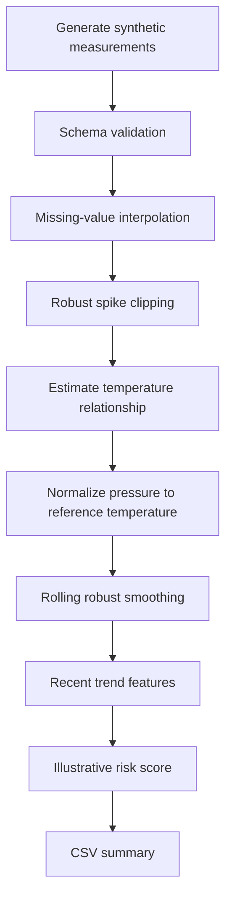

# Architecture

This public showcase is intentionally small and auditable. It demonstrates the shape of an industrial monitoring pipeline without reproducing proprietary implementation details.

## Data flow

## Components

### 1. Synthetic source

The demo generates several fictional devices with different behaviors:

- stable behavior
- noisy but stable behavior
- mild decline
- sustained decline

The generated identifiers have no relationship to real equipment.

### 2. Data-quality layer

The public pipeline demonstrates two common techniques:

- time-series interpolation for a small number of missing measurements
- robust clipping for isolated spikes

These are generic examples, not production rules.

### 3. Environmental normalization

Pressure and temperature can be correlated. The demo estimates a per-device linear relationship and expresses pressure relative to a reference temperature. This is intentionally a simple statistical baseline.

### 4. Time-aware features

The demo summarizes behavior using recent:

- normalized pressure trend
- drop relative to an early baseline period
- local volatility

The focus is persistence over time rather than reacting to a single sample.

### 5. Explainable scoring

A transparent logistic score combines the illustrative features into a value between 0 and 1. Its constants are chosen only to make the synthetic scenarios visually separable.

They are **not field thresholds** and are not derived from the protected implementation.

## Production considerations not represented here

A real deployment may require substantially more work, including sensor calibration, domain-specific validation, leakage labeling, temporal cross-validation, drift monitoring, alarm policy design, model governance, cybersecurity, and operational safety review.
